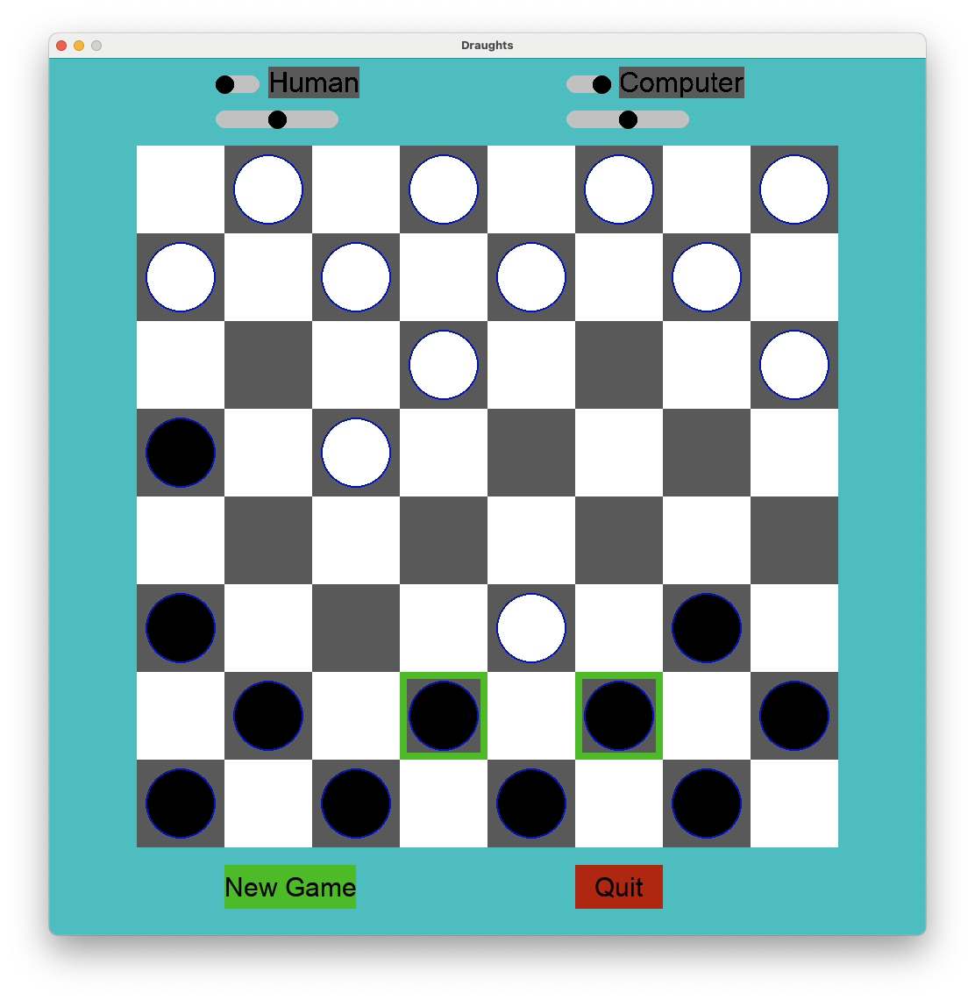

# Draughts (Checkers)

Draughts uses an alpha/beta search to choose a move. Game can be used to play the computer against itself - the sliders determining the tree search depth (skill level). Its not very good - needing a better GameState._evaluate_position(self) heuristic.

Difficult to test because it easily beats me.

